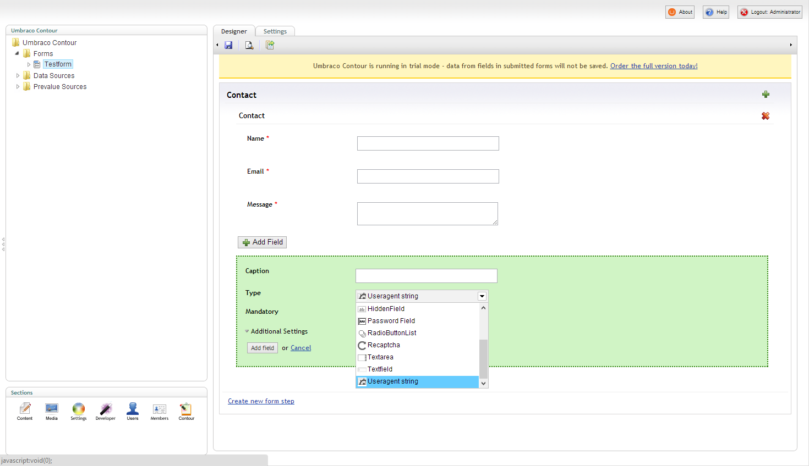

# Contour Useragent Fieldtype

**With this simple Contour field type you can add the current request's useragent string to the form results. If you need to know what browser was used when sending i.e. a feedback or problem report form.**  

##How does it look?

It's a basic Contour field type that you can add to your form easily:

## How to install and use?
Drop the compiled assembly into /bin and also copy over

- /umbraco/Plugins/umbracoContour/Views/FieldType.UseragentString.cshtml
- /umbraco/Plugins/umbracoContour/images/fieldtypes/useragentstring.png

<!--
##Download: Ready to use as an Umbraco Package
You can [download](http://our.umbraco.org/ "Download the Package") "Contour Useragent Fieldtype" as a ready to use Umbraco package and plug it into your site easily.
-->

##Licence
Licensed under the [Apache License, Version 2.0](http://www.apache.org/licenses/LICENSE-2.0.html), which allows open source as well as commercial use.

##Author
Follow [esn303](https://twitter.com/esn303 "@esn303") on Twitter. Like [mindrevolution](https://www.facebook.com/mindrevolution) on Facebook. 

This project is open for collaboration. **Fork. Push. Innovate.**

